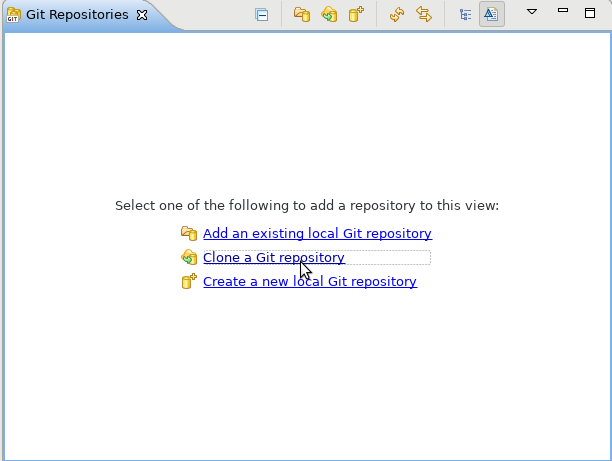

1.  Creare una repository su github e clonarla localmente:


2. Nella repository locale creare una cartella chiamata tutorial:


3. Spostarsi nella cartella appena creata e eseguire la build Gradle \texttt{init} per una applicazione java:
```
    $ gradle init --type java-application
```


4. Modificare il build.gradle sostituendolo con questa versione:
```
plugins {
    id 'java'
    id 'application'
    id 'eclipse'
}

mainClassName = 'App'

repositories {
    mavenCentral()
}

dependencies {
    testImplementation 'junit:junit:4.12'
}

task  wrapper(type: Wrapper) {
    gradleVersion = '4.6'
    distributionType = Wrapper.DistributionType.ALL
}
```
Con questo setting del file build abbiamo impostato sia il plugin di eclipse sia la distribuzione del wrapper da usare.

5. Aggiornare quindi il wrapper con la build relativa:
```
    $ ./gradlew wrapper
```

6. Creare i meta dati di eclipse con la build omonima definita dal plugin stesso:
```
    $ ./gradlew eclipse
```

7. Possiamo ora importare la repository su Eclipse:



8. Importare poi il progetto creato:


9. Effettuare il login su [travis-ci.org](https://travis-ci.org) e aggiungere la repository Github creata:


 Attivare la repository:


Andare nelle impostazioni della repository:


 
E indicare al server di eseguire la build solo nel caso in cui ci sia il travis.yml:


10. Creiamo il file `travis.yml` nel quale andremo a indicare la build da eseguire, impostiamo quindi il file in questo modo:

```
    language: java

    jdk:
        - oraclejdk8
        - oraclejdk9

    # cache settings
    before_cache:
        - rm -f  $HOME/.gradle/caches/modules-2/modules-2.lock
        - rm -fr $HOME/.gradle/caches/*/plugin-resolution/
    cache:
        directories:
            - $HOME/.gradle/caches/
            - $HOME/.gradle/wrapper/

    script:
        - ./tutorial/gradlew --no-daemon -b tutorial/build.gradle test
```

Salvando ed aggiornando potremmo vedere che Travis inizierà ad eseguire la build specificata nel file appena creato. Il risultato dovrebbe essere qualcosa di simile:


11. \item Possiamo importare il tag dello stato della build nel README della repository per ottenere:


Nella build di travis accanto al nome della repository c'è questo tag:


Cliccandoci si apre una finestra in cui potrete scegliere il branch e la modalità di import, nel nostro caso avremo bisogno del codice markdown che corrisponderà ad una istruzione di questo tipo: 

```
[](https://travis-ci.org/<User>/<gitRepositoryName>))
```

Copiamo e incolliamo (con le dovute modifiche) direttamente nel README.md ottenendo il risultato mostrato sopra.

12. Prima di proseguire con un esempio pratico importiamo la dipendenza Mockito utile per i test successivi:

```
dependencies {
    testImplementation 'junit:junit:4.12'
    testImplementation 'org.mockito:mockito-core:2.18.0'
```

Quando si aggiungono nuove dipendenze è importante indicare a eclipse il nuovo classpath, eseguire quindi sia il task `dependencies` per scaricare le dipendenze che il task \texttt{eclipse} per aggiornare il classpath.

13.  Nei passi successivi si consiglia di creare un nuovo branch per poter vedere meglio la funzionalità di Travis. Lo schema delle classi da creare è il seguente:


Il codice di test di StudentService è:

```
import static org.junit.Assert.*;
import static org.mockito.Mockito.*;

import java.util.ArrayList;
import java.util.List;

import org.junit.Before;
import org.junit.Test;

import attsw.exam.example.core.repository.Repository;
import attsw.exam.example.core.service.StudentService;

public class StudentServiceTest {

	StudentService studentService;
	List<Student> studentsList;
	Repository repository;

	@Before
	public void init() {
		studentsList = new ArrayList<Student>();
		repository = mock(Repository.class);
		studentService = new StudentService(repository);
		when(repository.findAll()).thenReturn(studentsList);
	}

	@Test
	public void testAllStudentsWithNoStudents() {
		verifyNumberOfStudents(0);
	}

	@Test
	public void testAllStudents() {
		studentsList.add(newStudentTest("id0"));
		studentsList.add(newStudentTest("id1"));
		verifyNumberOfStudents(2);
	}

	@Test
	public void testOneStudentWhenStudentsIsEmpty() {
		when(repository.findOne("id0")).thenReturn(null);
		assertNull(studentService.oneStudent("id0"));
		verify(repository, times(1)).findOne("id0");
	}

	@Test
	public void testOneStudent() {
		when(repository.findOne("id0")).thenReturn(newStudentTest("id0"));
		Student oneStudent = studentService.oneStudent("id0");
		assertNotNull(oneStudent);
		assertEquals("id0", oneStudent.getId());
		verify(repository,times(1)).findOne("id0");
	}

	private Student newStudentTest(String idStudent) {
		return new Student(idStudent);
	}

	private void verifyNumberOfStudents(int expected) {
		assertEquals(expected, studentService.getAllStudents().size());
		verify(repository, times(1)).findAll();
	}

}
```

Il codice di test di StudentController è:

```
import static org.junit.Assert.*;
import static org.mockito.Mockito.*;

import java.util.ArrayList;
import java.util.List;
import java.util.stream.Collectors;

import org.junit.Before;
import org.junit.Test;

import attsw.exam.example.core.controller.StudentController;
import attsw.exam.example.core.service.IStudentService;

public class StudentControllerTest {

	StudentController studentController;
	private List<Student> studentsList;
	private IStudentService iStudentService;

	@Before
	public void init() {
		studentsList = new ArrayList<Student>();
		iStudentService = mock(IStudentService.class);
		when(iStudentService.getAllStudents()).thenReturn(studentsList);
		studentController = new StudentController(iStudentService);
	}

	@Test
	public void testGetAllStudentsWhenThereAreNoStudents() {
		assertGetAllStudent("");
	}

	@Test
	public void testGetAllStudents() {
		studentsList.add(newStudentTest("id0"));
		studentsList.add(newStudentTest("id1"));
		assertGetAllStudent(extractAllStudentsStringFromList(studentsList));
		verify(iStudentService, times(1)).getAllStudents();
	}

	@Test(expected = NullPointerException.class)
	public void testGetOneStudentWhenThereAreNoStudents() {
		assertNull(studentController.getOneStudent("id0"));
	}

	@Test
	public void testGetStudent() {
		Student student = new Student("id0");
		when(iStudentService.oneStudent("id0")).thenReturn(student);
		assertEquals(student.toString(), studentController.getOneStudent("id0"));
		verify(iStudentService, times(1)).oneStudent("id0");
	}

	private String extractAllStudentsStringFromList(List<Student> list) {
		return list.stream().map(student -> student.toString() + System.getProperty("line.separator"))
				.collect(Collectors.joining());
	}

	private void assertGetAllStudent(String expected) {
		assertEquals(expected, studentController.getAllStudents());
		verify(iStudentService, times(1)).getAllStudents();
	}

	private Student newStudentTest(String idStudent) {
		return new Student(idStudent);
	}

}
```

A partire da queste 2 classi di test è possibile ricavarsi l'implementazione del codice completo:

```
public class Student {

	private String id;

	public Student(String id) {
		this.id = id;
	}

	public String getId() {
		return this.id;
	}

	@Override
	public String toString() {
		return "Student [id=" + id + "]";
	}
}
```

```
import java.util.List;

import attsw.exam.example.core.Student;
import attsw.exam.example.core.repository.Repository;

public class StudentService implements IStudentService{

	private Repository repository;

	public StudentService(Repository repository) {
		this.repository = repository;
	}

	public List<Student> getAllStudents() {
		return repository.findAll();
	}

	public Student oneStudent(String idStudent) {
		return repository.findOne(idStudent);
	}

}
```

```
import java.util.stream.Collectors;

import attsw.exam.example.core.service.IStudentService;

public class StudentController implements IStudentController {

	private IStudentService studentService;

	public StudentController(IStudentService iStudentService) {
		this.studentService = iStudentService;

	}

	public String getAllStudents() {
		return studentService.getAllStudents().stream()
				.map(student -> student.toString() + System.getProperty("line.separator"))
				.collect(Collectors.joining());
	}

	public String getOneStudent(String idStudent) {
		return studentService.oneStudent(idStudent).toString();
	}
}
```

```
import java.util.List;

import attsw.exam.example.core.Student;

public interface Repository {

	public List<Student> findAll();

	public Student findOne(String id);

}
```

A questo punto si ha un codice effettivo in cui Travis può eseguire la build precedentemente impostata.

14. Andiamo ora a generare dei report sul codice appena scritto, per farlo aggiungiamo ai plugin di Gradle sia Jacoco che Sonarqube:

```
plugins {
    id 'java'
    id 'application'
    id 'eclipse'
  	id "org.sonarqube" version "2.6"
  	id 'jacoco'
}

mainClassName = 'App'

repositories {
    mavenCentral()
}

dependencies {
    testImplementation 'junit:junit:4.12'
    testImplementation 'org.mockito:mockito-core:2.18.0'
}

task  wrapper(type: Wrapper) {
    gradleVersion = '4.6'
    distributionType = Wrapper.DistributionType.ALL
}

sonarqube {
    properties {
        property "sonar.projectName", "Java :: tutorial :: SonarQube Scanner for Gradle"
        property "sonar.jacoco.reportPath", "${project.buildDir}/jacoco/"
    }
}
```

Per eseguire Sonarqube useremo un contenitore server di Docker che genererà una pagina accessibile direttamente dal browser, inoltre Sonarqube avrà bisogno di un database server che creeremo sempre con Docker. Jacoco sarà usato invece da Sonarqube per generare il rapporto di code coverage. Entrambi i server verranno eseguiti compilando un docker-compose, per poter compilare ed eseguire entrambi i server Docker è necessario installare sia docker che docker-compose. All'interno della cartella del progetto creiamo un file chiamato `docker-compose.yml` in cui scriveremo:

```
version: "2"

services:
  sonarqube:
    image: sonarqube
    ports:
      - "9000:9000"
    networks:
      - sonarnet
    environment:
      - SONARQUBE_JDBC_URL=jdbc:postgresql://db:5432/sonar
    volumes:
      - sonarqube_conf:/opt/sonarqube/conf
      - sonarqube_data:/opt/sonarqube/data
      - sonarqube_extensions:/opt/sonarqube/extensions
      - sonarqube_bundled-plugins:/opt/sonarqube/lib/bundled-plugins

  db:
    image: postgres
    networks:
      - sonarnet
    environment:
      - POSTGRES_USER=sonar
      - POSTGRES_PASSWORD=sonar
    volumes:
      - postgresql:/var/lib/postgresql
      - postgresql_data:/var/lib/postgresql/data

networks:
  sonarnet:
    driver: bridge

volumes:
  sonarqube_conf:
  sonarqube_data:
  sonarqube_extensions:
  sonarqube_bundled-plugins:
  postgresql:
  postgresql_data:
```

Questo file è possibile trovarlo nella pagina Github della Docker image di Sonarqube: [https://github.com/SonarSource/docker-sonarqube/blob/master/recipes.md](github.com/SonarSource/docker-sonarqube/blob/master/recipes.md). Componiamo questo contenitore andando a eseguire il comando:

```
   $ docker-compose up
```

Prenderà un po' di tempo, circa 3/4 minuti in base alla connessione e alla macchina su cui si sta lavorando, avrà finito quando il terminale avrà in output:

```
sonarqube_1  | 2018.04.10 11:49:53 INFO  app[][o.s.a.SchedulerImpl] Process[ce] is up
sonarqube_1  | 2018.04.10 11:49:53 INFO  app[][o.s.a.SchedulerImpl] SonarQube is up
```

A questo punto facciamo ripartire il contenitore, eseguendo in un altro terminale il comando:

```
   $ docker-compose restart sonarqube
```

Una volta completato questo comando possiamo controllare se effettivamente il server sta funzionando visitando la pagina [https://localhost:9000/](https://localhost:9000/):


15. Dobbiamo analizzare il progetto che abbiamo creato, per farlo basterà eseguire il task sonarqube del plugin omonimo, eseguiamo quindi (da terminale o da eclipse):

```
   $ ./gradlew sonarqube
```

Non appena la build sarà completata Sonarqube verrà aggiornato:


Cliccando sul numero di Projects Analyzed verranno mostrati i progetti analizzati e selezionando il progetto da visualizzare avremo la schermata di report del nostro progetto:


16. Dal terminale possiamo eseguire il comando:

```
   $ docker ps -a
```

In output avremo tutti i contenitori attualmente attivi sulla nostra macchina, nel nostro caso avremo 2 contenitori corrispondenti alle immagini: sonarqube e postgress (database server usato da sonarqube). Una volta completata la nostra analisi del codice è possibile stoppare il contenitore e eliminarlo. Stoppiamo prima il contenitore del database e poi quello di sonarqube:

```
   $ docker stop <nome_del_contenitore>
```

Una volta stoppati eliminiamoli usando il comando:

```
   $ docker rm <nome_del_contenitore>
```

17. Potremmo usare Docker anche per creare un server database su cui testare la nostra applicazione, nel nostro caso per creare un vero e proprio database in cui inserire la lista di studenti. Useremo le dipendenze: MongoDB e Jongo per creare il database, FakeMongo per i test. Aggiorniamo quindi il campo `dependencies` del file di configurazione di gradle:

```
dependencies {
    testImplementation 'junit:junit:4.12'
    testImplementation 'org.mockito:mockito-core:2.18.0'
    testImplementation 'com.github.fakemongo:fongo:1.6.5'
    testImplementation 'ch.qos.logback:logback-classic:1.1.1'
    implementation 'org.mongodb:mongo-java-driver:2.14.3'
    implementation 'org.jongo:jongo:1.3.0'
}
```

La dipendenza `ch.qos.logback:logback-classic:1.1.1` è una dipendenza di FakeMongo necessaria. Da terminale eseguiamo ora i task `dependencies` per scaricare le dipendenze e `eclipse` per aggiornare il classpath:

```
   $ ./gradlew dependencies ; ./gradlew eclipse
```

18. Aggiorniamo quindi lo schema delle classi aggiungendo la classe `MongoRepository` che implementerà la classe `Repository`:


Il codice di test per questa nuova classe sarà il seguente:

```
import static org.junit.Assert.assertEquals;
import static org.junit.Assert.assertNotNull;
import static org.junit.Assert.assertNull;
import static org.junit.Assert.assertTrue;

import java.util.List;

import org.junit.Before;
import org.junit.Test;

import com.mongodb.BasicDBObject;
import com.mongodb.DB;
import com.mongodb.DBCollection;
import com.mongodb.MongoClient;
import com.github.fakemongo.Fongo;
import com.mongodb.MongoClient;

import attsw.exam.example.core.repository.Repository;
import attsw.exam.example.core.repository.mongo.MongoRepository;

public class MongoRepositoryTest {

	Repository mongoRepository;
	DBCollection students;

	@Before
	public void init() {
		MongoClient mongoClient = new Fongo("Mongo Server").getMongo();
		DB db = mongoClient.getDB("School");
		db.getCollection("Students").drop();
		mongoRepository = new MongoRepository(mongoClient);
		students = db.getCollection("Students");
	}

	@Test
	public void testGetAllStudentsEmpty() {
		assertTrue(mongoRepository.findAll().isEmpty());
	}

	@Test
	public void testOneStudent() {
		addStudentToStudentsCollection("id1");
		assertEquals(1, mongoRepository.findAll().size());
	}

	@Test
	public void testMoreThanOneStudentsInCollection() {
		addStudentToStudentsCollection("id1");
		addStudentToStudentsCollection("id2");
		List<Student> listOfStudents = mongoRepository.findAll();
		assertEquals(2, listOfStudents.size());
		assertEquals("id1", listOfStudents.get(0).getId());
		assertEquals("id2", listOfStudents.get(1).getId());
	}

	@Test
	public void testStudentNotFound() {
		assertNull(mongoRepository.findOne("id1"));
	}

	@Test
	public void testStudentFound() {
		addStudentToStudentsCollection("id1");
		addStudentToStudentsCollection("id2");
		Student student = mongoRepository.findOne("id2");
		assertNotNull(student);
		assertEquals("id2", student.getId());
	}

	private void addStudentToStudentsCollection(String idValue) {
		BasicDBObject document = new BasicDBObject();
		document.put("id", idValue);
		students.insert(document);
	}
}
```

Questa classe di test servirà per la creazione della classe MongoRepository:

```
import java.util.List;
import java.util.stream.Collectors;
import java.util.stream.StreamSupport;

import com.mongodb.BasicDBObject;
import com.mongodb.DBCollection;
import com.mongodb.DBCursor;
import com.mongodb.DBObject;
import com.mongodb.MongoClient;

import attsw.exam.example.core.Student;
import attsw.exam.example.core.repository.Repository;

public class MongoRepository implements Repository {
	
	DBCollection students;

	public MongoRepository(MongoClient mongoClient) {
		students = mongoClient.getDB("School").getCollection("Students");
	}

	@Override
	public List<Student> findAll() {
		DBCursor cursor = students.find();
		return StreamSupport.stream(cursor.spliterator(), false).map(element -> new Student((String) element.get("id")))
				.collect(Collectors.toList());
	}

	@Override
	public Student findOne(String id) {
		BasicDBObject element = new BasicDBObject();
		element.put("id", id);
		DBObject findOne = students.findOne(element);
		return findOne != null ? new Student((String) findOne.get("id")) : null;
	}

}
```

I test avranno successo grazie al database fittizio creato da Fongo.

19. Per poter testare il funzionamento di MongoRepository con un vero database creeremo la classe di Integration Test:

```
import static org.junit.Assert.assertEquals;
import static org.junit.Assert.assertNotNull;
import static org.junit.Assert.assertNull;
import static org.junit.Assert.assertTrue;

import java.util.List;

import org.junit.Before;
import org.junit.Test;

import com.mongodb.BasicDBObject;
import com.mongodb.DB;
import com.mongodb.DBCollection;
import com.mongodb.MongoClient;
import java.net.UnknownHostException;

import attsw.exam.example.core.repository.Repository;
import attsw.exam.example.core.repository.mongo.MongoRepository;

public class MongoRepositoryIT {

	Repository mongoRepository;
	DBCollection students;

	@Before
	public void init() {
		MongoClient mongoClient = new MongoClient();
		DB db = mongoClient.getDB("School");
		db.getCollection("Students").drop();
		mongoRepository = new MongoRepository(mongoClient);
		students = db.getCollection("Students");
	}

	@Test
	public void testGetAllStudentsEmpty() {
		assertTrue(mongoRepository.findAll().isEmpty());
	}

	@Test
	public void testOneStudent() {
		addStudentToStudentsCollection("id1");
		assertEquals(1, mongoRepository.findAll().size());
	}

	@Test
	public void testMoreThanOneStudentsInCollection() {
		addStudentToStudentsCollection("id1");
		addStudentToStudentsCollection("id2");
		List<Student> listOfStudents = mongoRepository.findAll();
		assertEquals(2, listOfStudents.size());
		assertEquals("id1", listOfStudents.get(0).getId());
		assertEquals("id2", listOfStudents.get(1).getId());
	}

	@Test
	public void testStudentNotFound() {
		assertNull(mongoRepository.findOne("id1"));
	}

	@Test
	public void testStudentFound() {
		addStudentToStudentsCollection("id1");
		addStudentToStudentsCollection("id2");
		Student student = mongoRepository.findOne("id2");
		assertNotNull(student);
		assertEquals("id2", student.getId());
	}

	private void addStudentToStudentsCollection(String idValue) {
		BasicDBObject document = new BasicDBObject();
		document.put("id", idValue);
		students.insert(document);
	}
}
```

Notiamo che in questa classe di test la differenza è che non useremo Fongo ma un vero e proprio client Mongo. Questo test non potrà funzionare, infatti darà un errore di tipo `MongoTimeoutException`:


Che indica semplicemente che la classe di test non riesce a collegarsi al database, che effettivamente non esiste. Prima di creare un contenitore database facciamo un refactor delle 2 classi di test del MongoRepository per rendere più chiara la loro implementazione:

```
import static org.junit.Assert.assertEquals;
import static org.junit.Assert.assertNotNull;
import static org.junit.Assert.assertNull;
import static org.junit.Assert.assertTrue;

import java.net.UnknownHostException;
import java.util.List;

import org.junit.Before;
import org.junit.Test;

import com.mongodb.BasicDBObject;
import com.mongodb.DB;
import com.mongodb.DBCollection;
import com.mongodb.MongoClient;

import attsw.exam.example.core.repository.Repository;
import attsw.exam.example.core.repository.mongo.MongoRepository;

public abstract class AbstractMongoRepositoryTest {

	Repository mongoRepository;
	DBCollection students;

	@Before
	public void init() throws UnknownHostException {
		MongoClient mongoClient = extractMongoClient();
		DB db = mongoClient.getDB("School");
		db.getCollection("Students").drop();
		mongoRepository = new MongoRepository(mongoClient);
		students = db.getCollection("Students");
	}

	@Test
	public void testGetAllStudentsEmpty() {
		assertTrue(mongoRepository.findAll().isEmpty());
	}

	@Test
	public void testOneStudent() {
		addStudentToStudentsCollection("id1");
		assertEquals(1, mongoRepository.findAll().size());
	}

	@Test
	public void testMoreThanOneStudentsInCollection() {
		addStudentToStudentsCollection("id1");
		addStudentToStudentsCollection("id2");
		List<Student> listOfStudents = mongoRepository.findAll();
		assertEquals(2, listOfStudents.size());
		assertEquals("id1", listOfStudents.get(0).getId());
		assertEquals("id2", listOfStudents.get(1).getId());
	}

	@Test
	public void testStudentNotFound() {
		assertNull(mongoRepository.findOne("id1"));
	}

	@Test
	public void testStudentFound() {
		addStudentToStudentsCollection("id1");
		addStudentToStudentsCollection("id2");
		Student student = mongoRepository.findOne("id2");
		assertNotNull(student);
		assertEquals("id2", student.getId());
	}

	private void addStudentToStudentsCollection(String idValue) {
		BasicDBObject document = new BasicDBObject();
		document.put("id", idValue);
		students.insert(document);
	}


	protected abstract MongoClient extractMongoClient() throws UnknownHostException;
}
```

Di conseguenza l'implementazione del metodo extractMongoclient() verrà fatta nelle classi effettive di test:

```
import com.github.fakemongo.Fongo;
import com.mongodb.MongoClient;

public class MongoRepositoryTest extends AbstractMongoRepositoryTest {

	@Override
	protected MongoClient extractMongoClient() {
		return new Fongo("Mongo Server").getMongo();
	}

}
```

```
import java.net.UnknownHostException;

import com.mongodb.MongoClient;

public class MongoRepositoryIT extends AbstractMongoRepositoryTest {

	@Override
	protected MongoClient extractMongoClient() throws UnknownHostException {
		return new MongoClient();
	}

}
```

A questo punto possiamo usare un contenitore Docker per creare il nostro database Mongo, per farlo eseguiamo su terminale:
```
   $ docker run -p 27017:27017 --rm mongo
```

Questo comando scaricherà il contenitore chiamato mongo e lo eseguirà sulla porta 27017. A questo punto possiamo eseguire la classe di test MongoRepositoryIT che sfruttando questo contenitore eseguirà con successo i test:


20. Il problema ora è eseguire gli integration test anche su Travis, per farlo useremo la dipendenza [testcontainers](https://github.com/testcontainers/testcontainers-java) che consentirà di creare un containers leggero per il test in cui viene usato. Aggiungiamo quindi la dipendenza `org.testcontainers:database-commons:1.7.2` al file di build.gradle:

```
dependencies {
    testImplementation 'junit:junit:4.12'
    testImplementation 'org.mockito:mockito-core:2.18.0'
    testImplementation 'com.github.fakemongo:fongo:1.6.5'
    testImplementation 'ch.qos.logback:logback-classic:1.1.1'
    testImplementation 'org.testcontainers:database-commons:1.7.2'
    implementation 'org.mongodb:mongo-java-driver:2.14.3'
    implementation 'org.jongo:jongo:1.3.0'
}
```

Useremo questa dipendenza nella nuova classe MongoRepositoryWithContainerIT:

```
import java.net.UnknownHostException;

import org.junit.ClassRule;
import org.testcontainers.containers.GenericContainer;

import com.mongodb.MongoClient;

public class MongoRepositoryWithContainerIT extends AbstractMongoRepositoryTest {

	@SuppressWarnings("rawtypes")
	@ClassRule
	public static GenericContainer mongo = new GenericContainer("mongo:latest").withExposedPorts(27017);

	@Override
	protected MongoClient extractMongoClient() throws UnknownHostException {
		return new MongoClient(mongo.getContainerIpAddress(), mongo.getMappedPort(27017));
	}
}
```

Come ultimo passo è necessario indicare a travis che per eseguire la build deve installare il servizio docker con database mongo, modifichiamo quindi il .travis.yml come segue:

```
language: java

jdk:
  - oraclejdk8
  - oraclejdk9

services:
  - docker

# cache settings
before_cache:
  - rm -f  $HOME/.gradle/caches/modules-2/modules-2.lock
  - rm -fr $HOME/.gradle/caches/*/plugin-resolution/

cache:
  directories:
    - $HOME/.gradle/caches/
    - $HOME/.gradle/wrapper/

install:
  - docker pull mongo

script:
- ./tutorial/gradlew --no-daemon -b tutorial/build.gradle test
```

21. Se la build continuerà a fallire il motivo è che non abbiamo escluso la classe MongoRepositoryIT che necessita il contenitore docker in esecuzione, modifichiamo il file di configurazione build.gradle aggiungendo:

```
test {
    failFast = true
    exclude "**/MongoRepositoryIT.*"
}
```

Possiamo anche indicare questa opzione direttamente nello script di travis:

```
script:
- ./tutorial/gradlew --no-daemon -b tutorial/build.gradle test --fail-fast
```

A questo punto i test avranno tutti successo anche su travis-ci.

